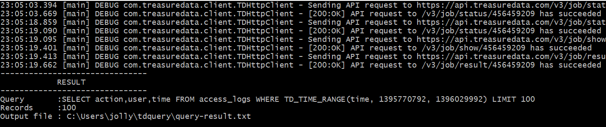
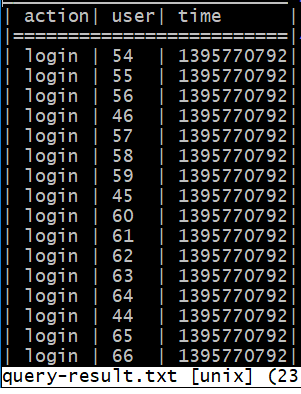

# td-query-cli
A java command line application to issue a query on Treasure Data and query a database and table to retrieve the values of specified set of columns in a specified date/time(min and max) range and download the results in CSV or tabular format. This application is using [td-client](https://github.com/treasure-data/td-client-java) to send job request to Treasure Data.

Using this CLI tool allows user to specify the following options:
- required: database name 'db_name'
- required: table name 'table_name'
- optional: comma separated list of columns ' col_list ' as string (e.g. 'column1,column2,column3 ’). If not specified, all columns are selected.
- optional: minimum timestamp 'min_time' in unix timestamp or 'NULL'
- optional: maximum timestamp 'max_time' in unix timestamp or 'NULL' .
(Obviously 'max_time' must be greater than 'min_time' or NULL.)
- optional: query engine ‘ engine ’: ' hive ' or ' presto '. Defaults to ‘presto’.
- optional: output format ‘ format ’: ‘ csv ’ or ‘ tabular '. Defaults to ‘tabular’.
- optional: a query limit ‘ limit ’: ‘ 100 ’. If not specified, all records are selected.

## Download
You can download the executable jar package(td-query-cli-0.0.1-SNAPSHOT-jar-with-dependencies.jar) bundled with dependencies from [here](https://drive.google.com/open?id=1OG4eZ7klazdtqU6aAAEV3j3HXtt0Sa_t) or [build](#build) from the source code.

## Setup
To connect to Treasure Data, you need to set your API key in the following file:

**$HOME/.td/td.conf**

```
[account]
  user = (your TD account e-mail address)
  apikey = (your API key)
```

You can retrieve your API key from [My profile](https://console.treasuredata.com/users/current) page.

It is also possible to use `TD_API_KEY` environment variable. Add the following configuration to your shell configuration `.bash_profile`, `.zprofile`, etc.

```
export TD_API_KEY = (your API key)
```

For more details, please refer to [Treasure Data](https://github.com/treasure-data/td-client-java/blob/master/README.md#usage)

## Usage
Run in the Command Prompt/Terminal

```
$ java -jar <JAR_PATH>/td-query-cli-0.0.1-SNAPSHOT-jar-with-dependencies.jar <databasename> <tablename> [options]
```

Required Arguments:
<pre>
&lt;databasename&gt;
&lt;tablename&gt;
</pre>

Options:
<pre>
-f / --format 			is optional and specifies the output format: tabular by default
-c / --column 			is optional and specifies the comma separated list of columns to restrict the result to. Read all columns if not specified.
-l / --limit 			is optional and specifies the limit of records returned. Read all records if not specified.
-m / --min 			is optional and specifies the minimum timestamp: NULL by default
-M / --MAX 			is optional and specifies the maximum timestamp: NULL by default
-e / --engine 			is optional and specifies the query engine: ‘presto’ by default

-d / --directory		is optional and specifies the output file directory: Out file will be stored in the user HOME directory by default
-k / --key			is optional and specifies the TD API key: Key in $HOME/.td/td.conf or in the variable setting will be used by default
--help				is optional to display all available commands.
</pre>


**Example:** 

```
$ java -jar <JAR_PATH>/td-query-cli-0.0.1-SNAPSHOT-jar-with-dependencies.jar test_db access_logs -f tabular -e hive -c 'action,user,time' -m 1395770792 -M 1396029992 -l 100
```

Console Output



Tabular Output file



 
## Run Unit test
Run unit test with Maven

```
$ mvn test
```

## Build
Build single jar file with Maven

```
$ mvn clean package
```

To skip running unit tests 
```
$ mvn clean package -Dmaven.test.skip=true
```

## Library Dependencies
Building single jar file using maven will be bundled with the following libraries:
- [td-client](https://github.com/treasure-data/td-client-java)
- [j-text-utils](https://code.google.com/archive/p/j-text-utils/)
- [msgpack-java](https://github.com/msgpack/msgpack-java)
- [logback-classic](https://github.com/qos-ch/logback)

These are included in the maven project file(pom.xml)

```
<dependencies>
	<dependency>
		<groupId>com.treasuredata.client</groupId>
		<artifactId>td-client</artifactId>
		<version>0.8.13</version>
	</dependency>
	<dependency>
		<groupId>ch.qos.logback</groupId>
		<artifactId>logback-classic</artifactId>
		<version>1.2.3</version>
	</dependency>
  	<dependency>
      <groupId>org.msgpack</groupId>
      <artifactId>msgpack-core</artifactId>
      <version>0.8.10</version>
    </dependency>
    <dependency>
      <groupId>com.massisframework</groupId>
      <artifactId>j-text-utils</artifactId>
      <version>0.3.4</version>
    </dependency>
</dependencies>
```

## System Requirements
- Java 1.8 or higher
- Maven
